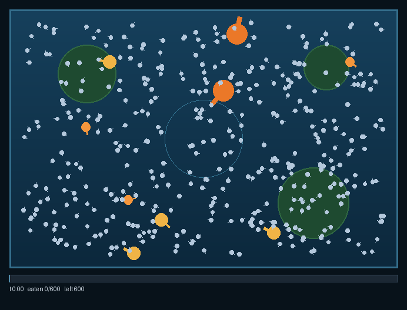

# Fish Food

**An agent-based algorithm where a heterogeneous swarm of consumers drains a
fixed batch of work in a bounded, near-constant time — inspired by feeding fish
in a pond.**



*(Short demo clip rendered with a reduced pellet count for file size; the default
configuration uses far more food and runs longer — see below.)*

---

## The idea

A fixed handful of fish-food pellets is dropped in the center of a pond. A mixed
school of fish swarms the clump: a couple of big, fast Koi, a few juveniles and
goldfish, and *hundreds* of tiny minnows. Their frantic motion does two things at
once — it **eats** the pellets and it **stirs the water**, advecting the clump
outward toward the walls and lily pads where leftovers stick.

The point worth seeing is **emergent**: the batch is consumed in roughly the
same **bounded, near-constant time regardless of the random initial layout** —
the way a handful of pellets is always gone in about the same few minutes. It is
*not* about *whether* the food finishes (capacity guarantees that); it is about
the **predictability of the completion time**.

## Definition

**Fish Food** is a heterogeneous multi-agent consumption model:

- A fixed batch of **work units** ("pellets") starts clustered in a 2-D field.
- A population of **consumer agents** ("fish") — a few large, fast,
  high-throughput consumers plus *many* tiny, low-throughput ones — locate and
  consume the work.
- The agents' own motion **advects** (diffuses) the unconsumed work outward,
  feeding it to otherwise-idle consumers.
- The emergent metric is the **completion time**, which clusters tightly across
  random initial conditions.

## Real-world use cases

- **Data / stream consumption.** Draining a fixed batch (a queue backlog, a
  partition, a nightly job) with a heterogeneous worker pool — a few big workers
  plus many micro-workers — where you care about a *predictable, SLA-bounded
  drain time* rather than peak throughput.
- **Autoscaling & work-stealing.** Estimating how fast a mixed-size fleet clears
  a burst, and how task "diffusion" (rebalancing) keeps idle workers fed.
- **Games.** Swarm/foraging AI and feeding-frenzy mechanics; RTS/idle resource
  nodes harvested by mixed unit types with bounded clear times for pacing;
  particle/cleanup systems (units that mop up spilled loot or debris).
- **Distributed-systems intuition.** A visual picture of load balancing and tail
  latency, and why *many small workers* tame variance better than a few big ones.
- **Operations research / ecology.** Foraging models, grazing, moderation-queue
  draining, and mark-sweep garbage-collection intuition.

## Install

Python 3 with its own virtualenv (no system packages or sudo needed):

```bash
python3 -m venv .venv
.venv/bin/pip install numpy pygame
# Pillow is only needed to render GIFs:
.venv/bin/pip install pillow
```

## Run

**Visual mode** (opens a window you can watch):

```bash
.venv/bin/python fish_food.py
```

Keys: `space` pause · `r` start a fresh random run · `q` / `esc` quit.

**Headless benchmark** (no window) — runs many seeded sims and reports how
constant the completion time is:

```bash
.venv/bin/python fish_food.py --runs 20
```

Output includes mean / median / stdev / min / max, a **CV%** (coefficient of
variation), a plain-English **verdict**, and a text **histogram** of completion
times. Lower CV = more constant-time behavior, which is the whole claim being
tested. Add `--plot out.png` to also save the histogram as an image.

Useful flags: `--seed N`, `--pellets N`, `--hard-fraction F`, `--plot PATH`,
`--max-seconds S`, `--fps N`, `--no-graph`.

### Modeling a mixed-difficulty workload (e.g. title research)

By default every unit is one easy bite. Set `--hard-fraction` (0–1) to make a
slice of the batch **hard**: hard units take several bites *and* require a
large-enough "mouth", so only the big consumers can finish them — the tiny ones
can't touch them. This models data of mixed difficulty (a simple deed vs. a
tangled chain of title), where routine items are cleared by a large cheap pool
but the gnarly ones must wait for a scarce expert/heavyweight worker.

```bash
.venv/bin/python fish_food.py --runs 12 --hard-fraction 0.2
```

The interesting question this lets you probe: does completion time stay
bounded/predictable when a chunk of the work can only be done by the few big
consumers? (Tune `hard_bites` and `hard_min_mouth` in `Config` to taste.)

A **scheduling policy** controls who works what: `--policy greedy` (default,
every consumer chases the nearest unit it can work) or `--policy specialist`
(big consumers prefer hard units, reserving the scarce heavyweight workers for
the bottleneck).

### Capacity estimate (no simulation)

For an instant, compute-free sanity check, print an analytic floor on the
completion time and compare it to a measured mean:

```bash
.venv/bin/python fish_food.py --theory --hard-fraction 0.25 --observed 607
```

This reports per-pool bite-rates, the hard-work bottleneck, an **optimistic
floor** (perfect utilization, zero travel), and the **travel/search overhead**
factor between that floor and your observed runs.

> `pygame` is imported lazily inside the visual code path, so the benchmark runs
> fine on a machine with no display or without `pygame` installed.

**Render a GIF** (headless, needs Pillow):

```bash
.venv/bin/python render_gif.py --seed 7 --out docs/demo.gif --pellets 600
```

## Is each run random or identical?

Both, by design. Every run is seeded: the **same seed reproduces an identical
run**, while **different seeds give different random ponds**. The benchmark uses
consecutive seeds so each run is a different layout — and the completion times
still cluster, which is the result the project exists to demonstrate.

## Findings so far

From 30-run benchmarks at 3000 units (your mileage will vary with parameters):

- **Uniform batch (0% hard):** mean ~3:22, **CV ~17%**.
- **Mixed batch (25% hard):** mean ~10:07, **CV ~17%**.
- Difficulty-gating a quarter of the work to the 6 big consumers **tripled the
  mean but left relative variability unchanged** — the process stays equally
  predictable, just slower.
- The capacity estimate shows real runs sit at only **~7–13% utilization**, i.e.
  an **~8–14× travel/search overhead** over the theoretical floor. The system is
  *search-limited*, not *capacity-limited*.
- A naive **specialist** routing policy did **not** help (slightly worse in a
  small test) — consistent with the above: prioritizing *which* unit to grab
  doesn't reduce the time spent *finding* scattered units. The next lever is
  reducing search overhead (e.g. recruitment/clustering, or larger sense range
  for the heavyweight workers), not task selection.

These are the kind of results that make the model useful for *planning*: it
quantifies bottlenecks and the cost of search, and predicts how mixing worker
sizes affects both speed and predictability.

## How it works (model)

- **Pond** — a rectangle with walls; pellets that reach a wall *stick* (velocity
  strongly damped). Lily-pad discs also trap/damp pellets.
- **Pump** — a fixed point applying a small constant outward push to nearby
  pellets (the pond's surface disturbance).
- **Pellets** — numpy arrays of position / velocity / alive / stuck. Each step
  they are advected by nearby fish wakes + the pump + small turbulence, with
  water drag damping velocity. They drop in progressively so the clump fills up.
- **Fish** — per-individual numpy state plus per-species parameters (speed,
  mouth/eat radius, sense radius, wake push, eat cooldown, lifetime eat cap,
  draw size, color). Fish doze at first, then **wake** (on a staggered timer or
  when food drifts near them), chase the nearest sensed pellet, otherwise wander,
  and eat within mouth range when their cooldown allows.

All tunable parameters live in the `Config` dataclass at the top of
`fish_food.py`.

## Tuning toward a target time

The completion time and its variance are emergent. The main levers:

- **Food amount** (`n_pellets`) and **clump size** — more/denser food → longer.
- **Fish speeds** and **sense radius** — smaller sense → more wandering → longer.
- **Eat cooldowns / minnow cap** — total throughput.
- **Push strength / wake radius / drag / turbulence** — how fast the clump
  spreads and sticks.

Run the benchmark across many seeds and watch the **CV%**: the goal is *low
variance* (constant time), not a specific mean.

## License

Source-available under the **PolyForm Noncommercial License 1.0.0** — see
[`LICENSE`](LICENSE). In short: the Fish Food algorithm is the intellectual
property of SilverSummitCo LLC; it is **free to use, modify, and share for any
non-commercial purpose** (keep the `Required Notice` with copies). Any
**commercial or profit-making use requires a separate commercial license** —
which includes prior permission, attribution, and a profit-share. See
[`COMMERCIAL.md`](COMMERCIAL.md). The license text is not legal advice.

© 2026 SilverSummitCo LLC
